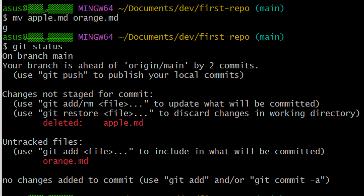
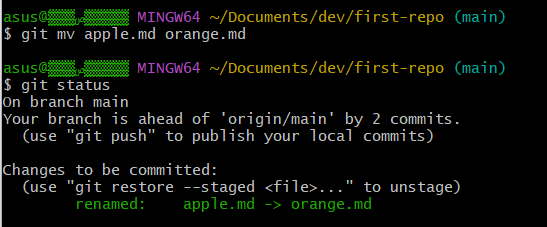

# Revert

## Rename

git에서 관리하는 파일의 이름을 변경하는 방법은 두 가지가 있다.

1. Bad way

`$ mv apple.md orange.md` -> `apple.md`가 deleted되고 `orange.md` 파일이 새로 생성되는 것으로 인식한다.




2. Good way

`$ git mv apple.md orange.md` -> `apple.md`가 `orange.md`로 renamed됨

✔️ 파일의 history를 남기기 위해서는 삭제 후 생성이 아닌 이름 바꾸기로 추적




## Undoing

<b>stage에 올라가기 전</b>, working directory에서의 변경 사항 폐기 및 최신 commit 상태로 돌아간다. (git add 전에만 가능)

* 파일 하나 복구 : `$ git restore {filename}`
* 전체 변경 사항 복구 : `$ git restore .`


## Unstaging

git add로 staging area에 올라간 상태에서 이를 취소하고 다시 working directory로 내려온다. (git commit 전에만 가능)

* Unstaging : `$ git reset HEAD {filename}`
  * `reset` 대신에 `restore` 사용 가능
* Unstaging and remove : `$ git rm -f {filename}`


## Edit Commit

### Edit latest commit

`$ git commit --amend`


### Edit prior commit

`$ git rebase -i <commitID>`


## Reset vs Revert

### Reset

Reset은 최근의 커밋을 작업트리(HEAD)까지 버리고 롤백하는 기능이다.

협업 시 다른 clone repository에 존재하던 commit log로 인해 파일이 살아나거나, 과거 이력이 깔끔히 사라져 commit log tracking이 힘들어진다.


아래와 같은 reset 명령어로 지정한 이력으로 돌아갈(undoing) 수 있다.


> `Reset --hard` : 복구된 이력 이후의 내용을 모두 삭제 후 초기화 (주의)
> `Reset --Soft` : 복구된 이력 이후 내용 모두 유지
>
> `Reset --mixed` : 복구된 이력 이후 내용 모두 유지, 그러나 인덱스 초기화 즉, 변경 내용 다시 추가해야 함.


```shell
# git reset으로 commit 복원
$ git reset --hard "CommitID"

# git reset으로 HEAD 복원(현재부터 6개 이전으로 복원)
$ git reset HEAD-6

# git remote에 강제 push
$ git push -f origin <branch>
```


### Revert

Revert는 상태를 되돌리지만(undo) <b>이전 이력은 그대로 보존</b>한다.

잘못하기 전 과거로 돌아가 최신을 유지하면서 되돌렸다는 이력을 commit으로 남겨 모든 팀원이 이 사항을 공유하고 주지시킬 수 있다.


```shell
# 현재 HEAD에서 직전 3개의 commit을 거슬러 올라감
$ git revert --no-commit HEAD~3..

# 해당 내역에 대해 commit, push 수행
$ git commit
$ git push origin <branch>
```


* commit을 따로 안할 땐 `--no-edit`
* merge commit을 되돌릴 땐 `$ git revert -m {1 or 2} {merge commit id}`


