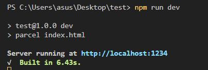
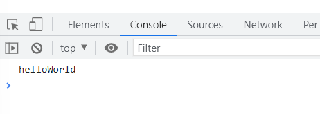

# Node.js

> **Node.js** : Chrome V8 Javascript 엔진으로 빌드된 Javascript 런타임

>**NPM** : 전 세계의 개발자들이 만든 다양한 기능(패키지, 모듈)들을 관리


## Node.js로 프로젝트 만들기

1. 프로젝트를 시작할 폴더에서 VSCode를 실행한다.
2. VSCode 터미널에서 `npm init -y`를 실행한다.
   * 폴더에 package.json이 생성되는 것을 볼 수 있다.

```json
{
  "name": "test", // 프로젝트의 이름
  "version": "1.0.0",
  "description": "",
  "main": "index.js", // 현재 프로젝트를 하나의 패키지로 npm에 업로드할 때 필요
  "scripts": {
    "test": "echo \"Error: no test specified\" && exit 1"
  }, // 현재 프로젝트 내부에서 사용할 수 있는 외부 스크립트 명령들을 작성하면, 프로젝트 내에서 사용 가능
  "keywords": [],
  "author": "",
  "license": "ISC"
}

```

3. `npm install parcel-bundler -D`를 설치한다.
   * node_modules 폴더와 package-lock.json이 생성되는 것을 볼 수 있다.
     * node_modules 폴더를 확인하면 parcel-bundler 모듈이 설치된 것을 볼 수 있다.
     * node_modules 폴더 내에 왜 다른 패키지도 설치되었는가? ➡️ parcel-bundler 사용하는데 필요하기 때문
     * package.json을 확인해보면 devDependencies에 "parcel-bundler"와 버전이 생긴걸 확인할 수 있다.
4. `npm install lodash`를 설치한다.
   * package.json을 확인해보면 dependencies에 "lodash"와 버전이 생긴걸 확인할 수 있다.
   * package-lock.json과 package.json에 정보가 저장되어 있기 때문에 node_modules 폴더가 삭제되더라도 `npm install`을 통해서 다시 해당 패키지들을 설치할 수 있다.


#### npm install -D와 npm install의 차이

* `$ npm install -D XXX` : 개발용 의존성 패키지 설치(-D, --save-dev)
  * 해당 패키지들은 개발할 때만 필요하고, 웹 브라우저 동작에서는 필요하지 않음
  * 예) BABEL, Bundler, Sass

* `$ npm install XXX` : 일반 의존성 설치
  * 해당 패키지들은 웹 브라우저에서도 동작할 수 있음을 전제함
  * 예) Lodash


#### Parcel Bundler로 브라우저에서 index.html 열기

open with Live Server를 사용해서 여는 것은 원시적인 방법이다.

parcel bundler를 사용해서 실행하는 방법을 알아보자.


* package.json의 "scripts" 부분에 아래 코드를 적어준다.

  `"dev": "parcel index.html"`

* 터미널에서 `$ npm run dev`를 실행한다.

  * 로컬 환경에서 개발 서버를 열겠다는 것을 의미한다. 
    

    


`http://localhost:1234` 주소를 통해서 개발 서버로 접속할 수 있다.

parcel bundler는 프로젝트에서의 변경 사항을 감지해 자동으로 개발 서버를 다시 작동시킨다.


#### Lodash 사용하기

* main.js 파일 내에 아래의 코드를 입력한다.

  `import _ from "lodash"`

  `_`라는 이름 안에 lodash의 기능을 할당한다.


* 사용 예시

```javascript
import _ from "lodash";

console.log(_.camelCase("hello world"));
```



데이터를 카멜케이스 방식으로 변환해서 출력하는 것을 확인할 수 있다.


#### parcel bundler로 사용자가 보는 화면 출력하기

* package.json의 "scripts" 부분에 아래 코드를 적어준다.

  `"build": "parcel build index.html"`

* 터미널에서 `$ npm run build`를 실행한다.

  * dist 폴더와 내부에 파일들이 생성되는 것을 확인할 수 있다.
  * dist 폴더 내에 있는 파일들은 실제 브라우저 동작 시 실행되는 파일들이다.
  * dist 폴더에 있는 파일들은 **코드 난독화**가 이뤄진다.
  * parcel bundler가 실제 브라우저 동작시 필요한 패키지까지 번들 작업을  한다.

> **코드 난독화** : 작성된 코드를 읽기 어렵게 만드는 작업
>
> 빌드된 결과(제품)는 브라우저에서 해석되는 용도로, 용량을 축소하고 읽기 어렵게 만드는 등의 최적화를 거치는 것이 좋다.

> **번들** : 프로젝트 개발에 사용한 여러 모듈(패키지)을 하나로 묶어내는 작업


## 유의적 버전(Semantic Versioning)

### ^Major.Minor.Patch

* 예시) ^12.14.1


#### Major

* 기존 버전과 호환되지 않는 새로운 버전


#### Minor

* 기존 버전과 호환되는 새로운 기능이 추가된 버전


#### Patch

* 기존 버전과 호환되는 버그 및 오타 등이 수정된 버전


#### ^

* Major 버전 안에서 가장 최신 버전으로 언제든지 업데이트 가능
  * Minor버전과 Patch 버전이 가장 최신 버전으로 업데이트 됨
  * `$ npm update XXX` 로 해당 패키지를 최신 버전으로 수동 업데이트 할 수 있음
  * 버전에 `^`을 명시하지 않으면 npm을 실행해도 최신 버전으로 업데이트되지 않음. 


## NPM 프로젝트의 버전 관리

* 후작업으로 만들어낼 수 있는 폴더들은 따로 버전 관리를 해줄 필요가 없다.
* 버전 관리를 해줄 필요가 없는 폴더와 파일들을 git에 push해 줄 필요가 없다.
  * `npm run`, `npm build`, `npm run dev`를 통해서 언제든지 다시 똑같은 버전으로 다시 생성할 수 있다.
  * node_modules 폴더에는 많은 폴더와 파일들이 있기 때문에 github에 업로드하는데에 시간이 오래걸려 node_modules를 버전 관리하는 것은 오히려 효율성을 떨어뜨리는 것이다.


#### 특정 폴더 및 파일 버전 관리 하지 않는 방법

* .gitignore 파일을 생성해서 해당 파일 내에 버전 관리 하지 않을 폴더 및 파일을 작성한다.
* `git init`으로 버전관리를 실행했을 때, 해당 파일들은 변경 사항 관리에서 제외된 것을 볼 수 있다.